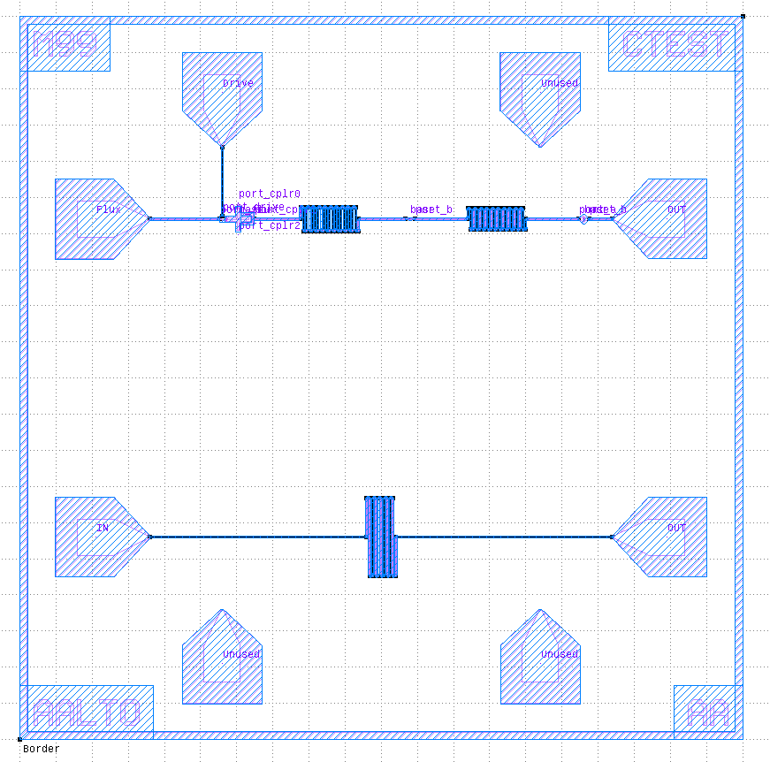

KLayout macros for microwave circuits.


# Installation of KQCircuit

## Recuirements
Tested with 
* Python 3.5.2, 
* KLayout 0.25.6, .8

Required packages
* numpy

## Linux
Typical location for local macros, which you can edit:
```
    ~/.klayout/python
```

Command to run KLayout:
```
    LD_LIBRARY_PATH=. ./klayout -e
```
tha path should point to the directory of the build directory. In my case 
```
    ~/Software/klayout-0.25.6/bin-release
```
which contains files `klayout` and `libkaylayout*.so`

## Windows
Typical location for local checkout:
```
	~/KLayout/python/kqcircuit 
```

On Windows 10 `~` stands for `C:\Users\<username>\KLayout\python\kqcircuit` or something similar.

# Installation of KLayout with python support
## Linux
Python 3.* is usually available out of box, but the latest KLayout has to be built from source. In Aalto one should built it into userspace without using `sudo`.


## Windows

Instructions:
1. Download latest KLayout *64 bit version* or, if you have KLayout already, check from "Help->About" that the embedded Python is compiled with 64 bit GCC.
2. Install "Python_packages_for_KLayout" KLayout package from `Tools->Manage packages`.

Explanation:
On windows everything is slightly complicated as it does not provide a nice infrastructure.
The embedded python has to be compiled with the same compiler, as the rest of KLayout. 
The good news is, that minimalistic Python is included in KLayout for windows. However, it is hard to add any less standard python modules.
KQC requires numpy. Luckly a precompiled version is available in KLayouts package manager. The numpy in the package seems to be compiled on a 64 bit system, and thus your KLayout also has to be 64 bit.

# Known issues

* Waveguides at arbitrary angles have 1 nm gaps in between due to finite precision of arithmetics.
* KLayout crashes if a definition of child PCell is updated. As a workaround delete the cell before updating.